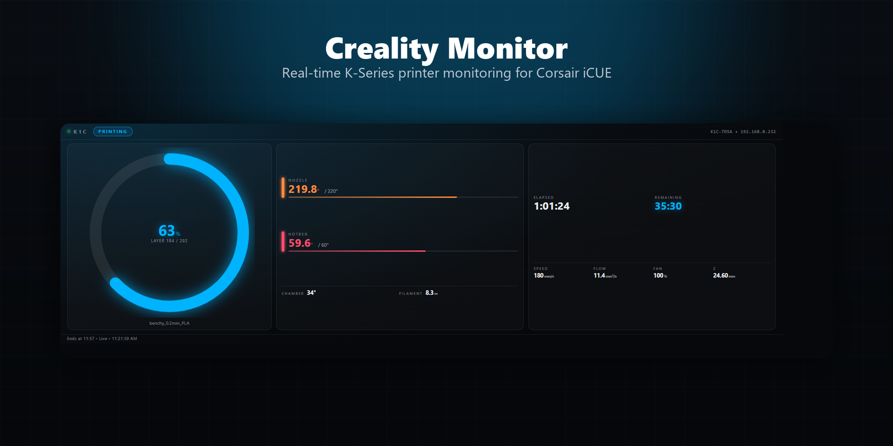
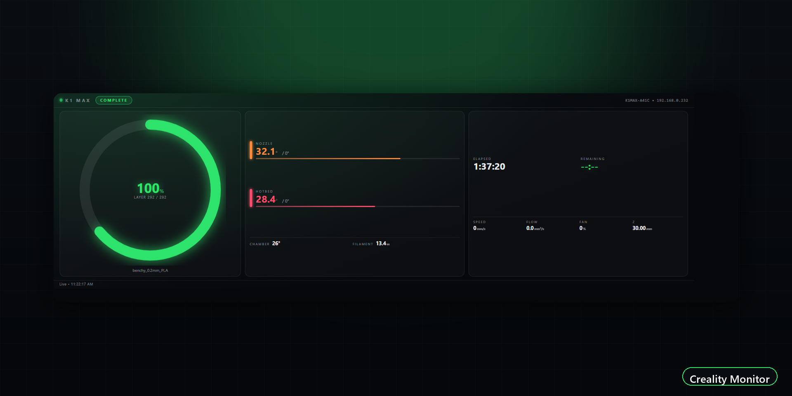
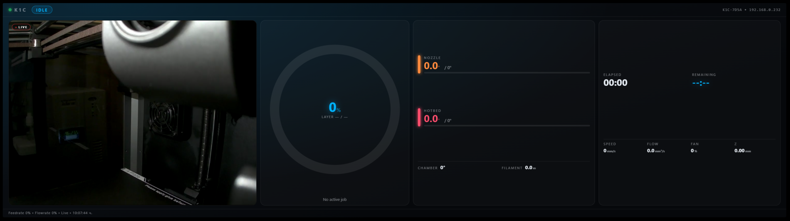

# Creality Monitor — iCUE Widget

[](LICENSE)
[](#requirements)

A Corsair iCUE widget for the **Xeneon Edge** that shows live print status,
temperatures and the camera stream of a Creality K‑series 3D printer, by
talking directly to the printer's own local network API (no cloud, no
Home Assistant, no extra software required on the printer or your PC).

Free, open source, and available on the iCUE Marketplace.





## Features

- Live connection status, print state (printing / paused / complete / error) and progress ring with current layer
- Nozzle & hotbed current/target temperature with heating indicator, plus chamber temperature
- Elapsed / remaining time, print speed, flow, fan and Z‑height
- Live WebRTC camera feed (optional, can be turned off)
- Automatic reconnect if the printer or network drops
- Adjustable accent color to match your setup

## Compatibility

Developed and tested against a **Creality K1C**. It should also work, with
little to no changes, on any Creality printer that exposes the same local
status WebSocket (port `9999`) and WebRTC camera signalling (port `8000`),
which at the time of writing includes the **K1, K1 Max, K1 SE, K2 Plus**
(and other printers built on the same firmware/API). If your model reports
fields this widget doesn't expect, it fails safe: unknown/missing fields are
simply shown as `—` or `0` instead of breaking the layout.

> If you test this on a different model, feedback on what works/doesn't is
> very welcome.

## Requirements

- Corsair iCUE **5.47+** with a **Xeneon Edge** (or other `dashboard_lcd` device)
- The printer and this PC on the **same local network**
- **LAN Mode** enabled on the printer (Creality OS printers only expose the
  status WebSocket/camera once this is turned on in the printer's network
  settings)

## Install

- **iCUE Marketplace** (recommended): open iCUE → Widgets → Marketplace →
  search **"Creality Monitor"**.
- **Manual**: grab the latest `.icuewidget` file from the
  [Releases](../../releases) page and import it in iCUE via
  **Xeneon Edge → Add Widget → Import**.

## Settings

| Setting | Description | Default |
|---|---|---|
| Printer Address | LAN IP of the printer | `192.168.0.232` |
| WebSocket Port | Status API port | `9999` |
| Show Camera | Toggle the live camera feed | On |
| This PC IP (camera) | This computer's LAN IP, used to work around a Chromium mDNS/WebRTC quirk that otherwise prevents the camera from connecting | `192.168.0.100` |
| Accent Color | Widget accent color | `#00b3ff` |

## Building the package

This repo ships the unpacked widget source in
[`CrealityMonitor_Template/`](CrealityMonitor_Template). To produce an
importable `.icuewidget` file, use the official
[iCUE Widget CLI](https://www.npmjs.com/package/icuewidget-cli):

```powershell
npm install -g icuewidget-cli
icuewidget validate CrealityMonitor_Template
icuewidget package CrealityMonitor_Template
```

Or run [`pack.ps1`](pack.ps1), which wraps the same CLI and names the output
`CrealityMonitor-v<version>.icuewidget`.

Import the resulting file in iCUE via **Xeneon Edge → Add Widget → Import**.

## Repo layout

| Path | Purpose |
|---|---|
| `CrealityMonitor_Template/` | Widget source (what gets packaged) |
| `pack.ps1` | Validates + packages a release build |
| `tools/compose_media.py` | Generates the marketing screenshots in `media/` from the live widget |
| `media/` | Marketplace/GitHub preview images |

## Privacy & permissions

The widget only talks to the printer address you configure (`ws:`/`http:`
on your local network) and never sends data anywhere else — there is no
telemetry, analytics, or cloud dependency.

## License

MIT — see [LICENSE](LICENSE).
